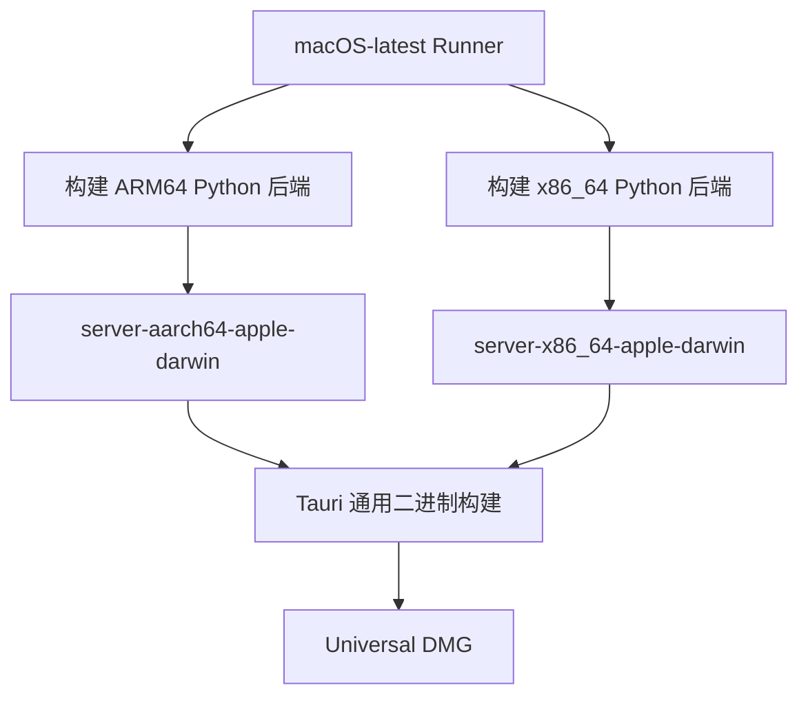

# Tauri 跨平台编译架构特定二进制文件配置

## 🎯 核心原理

根据 [Tauri 2.0 官方文档](https://v2.tauri.app/develop/sidecar/)：

> To make the external binary work on each supported architecture, a binary with the same name and a `-$TARGET_TRIPLE` suffix must exist on the specified path.

**关键点：**
1. 只需在 `tauri.conf.json` 配置基础名称：`"externalBin": ["binaries/server"]`
2. Tauri 自动根据 `TARGET_TRIPLE` 查找对应的架构特定文件
3. 不需要配置所有架构名称，Tauri 会自动处理

## 🔧 解决方案

### 1. 架构特定文件名映射

| 平台 | 架构特定文件名 | 说明 |
|------|---------------|------|
| macOS ARM64 | `server-aarch64-apple-darwin` | Apple Silicon (M1/M2/M3) |
| macOS x64 | `server-x86_64-apple-darwin` | Intel Mac |
| Windows x64 | `server-x86_64-pc-windows-msvc.exe` | Windows 64-bit |

### 2. Tauri 配置文件

**只需配置基础名称：**

```json
{
  "bundle": {
    "externalBin": [
      "binaries/server"
    ]
  }
}
```

**Tauri 的自动选择逻辑：**
```rust
// Tauri 内部逻辑（伪代码）
let target_triple = std::env::var("TARGET").unwrap(); // e.g., "aarch64-apple-darwin"
let binary_name = format!("binaries/server-{}", target_triple);
// Tauri 会自动查找：binaries/server-aarch64-apple-darwin
```

### 3. macOS 通用二进制（推荐）

使用单一 runner 构建通用二进制文件：

```yaml
build-macos:
  runs-on: macos-latest
  steps:
    # 构建两个架构的 Python 后端
    - name: Build ARM64 backend
      run: pyinstaller server.spec --distpath dist-server-arm64

    - name: Build x86_64 backend
      run: arch -x86_64 pyinstaller server.spec --distpath dist-server-x64

    # 复制到不同文件名
    - name: Copy architecture-specific binaries
      run: |
        cp dist-server-arm64/server binaries/server-aarch64-apple-darwin
        cp dist-server-x64/server binaries/server-x86_64-apple-darwin

    # 构建 Universal 二进制（包含两个架构）
    - name: Build Tauri app
      run: npm run tauri build -- --target universal-apple-darwin
```

**优点：**
- 单一 dmg 文件支持所有 Mac
- 用户下载后自动选择正确的架构
- 更好的用户体验

## 🚀 工作原理

### Tauri Sidecar 机制

1. **配置阶段**：在 `tauri.conf.json` 中声明 sidecar 路径
2. **构建阶段**：Tauri 根据 `TARGET_TRIPLE` 查找对应的架构特定文件
3. **运行阶段**：应用启动时自动选择正确的二进制文件

### macOS 交叉编译

macOS 原生支持交叉编译：
- **ARM64 Mac** 可以构建 x86_64 二进制文件（通过 Rosetta）
- **x86_64 Mac** 可以构建 ARM64 二进制文件
- 使用 `arch -x86_64` 命令强制 x86_64 环境

```bash
# 在 ARM64 Mac 上构建 x86_64 二进制
arch -x86_64 pyinstaller server.spec

# 验证架构
file dist-server/server
# Output: Mach-O 64-bit executable x86_64
```

## 📋 构建流程

### 完整流程图



### 验证方法

```bash
# 1. 检查二进制文件架构
file agentmatrix-desktop/src-tauri/binaries/server-*

# 预期输出：
# server-aarch64-apple-darwin: Mach-O 64-bit executable arm64
# server-x86_64-apple-darwin: Mach-O 64-bit executable x86_64

# 2. 检查 Universal 二进制
file AgentMatrix.app/Contents/MacOS/AgentMatrix

# 预期输出：
# Mach-O universal binary with 2 architectures: [x86_64:Mach-O 64-bit executable x86_64] [arm64:Mach-O 64-bit executable arm64]
```

## ⚠️ 注意事项

### 1. 文件权限

```bash
chmod +x agentmatrix-desktop/src-tauri/binaries/server-*
```

### 2. 架构特定命名

**不要使用通用名称：**
- ❌ `server` (在 CI 构建中)
- ✅ `server-aarch64-apple-darwin`
- ✅ `server-x86_64-apple-darwin`

**通用名称只在本地开发时使用。**

### 3. 平台差异

| 平台 | 文件扩展名 | 示例 |
|------|-----------|------|
| macOS | 无 | `server-aarch64-apple-darwin` |
| Windows | `.exe` | `server-x86_64-pc-windows-msvc.exe` |

### 4. TARGET_TRIPLE 查询

```bash
# 查看当前平台的 TARGET_TRIPLE
rustc --print host-tuple
# Output: aarch64-apple-darwin (ARM64 Mac)
#         x86_64-apple-darwin (Intel Mac)
#         x86_64-pc-windows-msvc (Windows)
```

## 🔍 故障排除

### 常见错误

1. **`resource path 'binaries/server-xxx' doesn't exist`**
   - 确保构建脚本生成了架构特定文件名
   - 验证文件权限：`chmod +x`

2. **`Wrong ELF type` / `Bad CPU type`**
   - 二进制文件架构与目标平台不匹配
   - 使用 `file` 命令验证架构

3. **Universal 二进制过大**
   - 正常现象，包含两份完整代码
   - 可考虑分别发布 ARM64 和 x86_64 版本

## 📚 相关资源

- [Tauri 2.0 Sidecar 官方文档](https://v2.tauri.app/develop/sidecar/)
- [Tauri 2.0 CLI 参考](https://v2.tauri.app/reference/cli/)
- [PyInstaller 官方文档](https://pyinstaller.org/en/stable/)
- [macOS 交叉编译指南](https://developer.apple.com/documentation/xcode/building-a-universal-macos-binary)

---

**总结**：
1. ✅ 只需在 `tauri.conf.json` 配置基础名称
2. ✅ Tauri 自动选择架构特定的二进制文件
3. ✅ macOS 可在单一 runner 上构建两个架构
4. ✅ 推荐 Universal 二进制以简化分发
