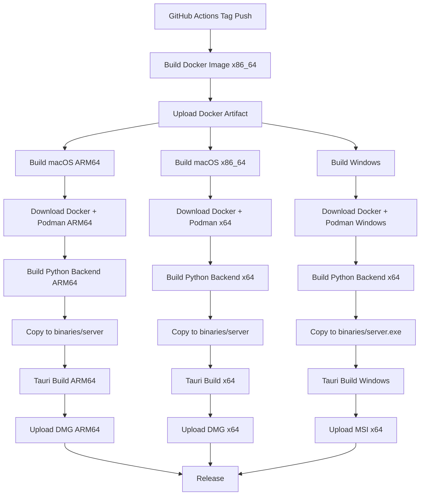

# Tauri 跨平台编译配置指南

## 🎯 核心原理

根据 [Tauri 2.0 官方文档](https://v2.tauri.app/develop/sidecar/)，sidecar 二进制文件的工作机制：

1. **配置基础名称**：在 `tauri.conf.json` 配置 `"externalBin": ["binaries/server"]`
2. **Tauri 自动处理后缀**：构建时 Tauri 自动根据 `TARGET_TRIPLE` 添加后缀
3. **文件名必须是基础名称**：文件应叫 `server`，不应包含 `-$TARGET_TRIPLE`

## 🔧 正确的配置方式

### 1. Tauri 配置文件

**只需配置基础名称：**

```json
{
  "bundle": {
    "externalBin": [
      "binaries/server"
    ]
  }
}
```

### 2. GitHub Actions 构建配置

**关键点：每个平台/架构使用独立的 job**

```yaml
# macOS ARM64
build-macos-arm64:
  runs-on: macos-latest  # ARM64 runner
  steps:
    - name: Copy server to sidecar directory
      run: |
        mkdir -p agentmatrix-desktop/src-tauri/binaries
        # ✅ 正确：复制为基础名称 'server'
        cp dist-server/server agentmatrix-desktop/src-tauri/binaries/server
        chmod +x agentmatrix-desktop/src-tauri/binaries/server

    - name: Build Tauri application
      run: npm run tauri build -- --target aarch64-apple-darwin
      # Tauri 会自动查找 binaries/server-aarch64-apple-darwin

# macOS x86_64
build-macos-x64:
  runs-on: macos-13  # Intel runner
  steps:
    - name: Copy server to sidecar directory
      run: |
        mkdir -p agentmatrix-desktop/src-tauri/binaries
        # ✅ 正确：复制为基础名称 'server'
        cp dist-server/server agentmatrix-desktop/src-tauri/binaries/server
        chmod +x agentmatrix-desktop/src-tauri/binaries/server

    - name: Build Tauri application
      run: npm run tauri build -- --target x86_64-apple-darwin
      # Tauri 会自动查找 binaries/server-x86_64-apple-darwin

# Windows
build-windows:
  runs-on: windows-latest
  steps:
    - name: Copy server to sidecar directory
      shell: bash
      run: |
        mkdir -p agentmatrix-desktop/src-tauri/binaries
        # ✅ 正确：复制为基础名称 'server.exe'
        cp dist-server/server.exe agentmatrix-desktop/src-tauri/binaries/server.exe

    - name: Build Tauri application
      run: npm run tauri build
      # Tauri 会自动查找 binaries/server-x86_64-pc-windows-msvc.exe
```

## ⚠️ 常见错误

### ❌ 错误 1：手动添加 TARGET_TRIPLE 后缀

```yaml
# ❌ 错误做法
- name: Copy server to sidecar
  run: |
    cp dist-server/server binaries/server-aarch64-apple-darwin  # 不要手动加后缀！
```

**后果**：Tauri 会再次添加后缀，导致 `server-aarch64-apple-darwin-aarch64-apple-darwin`

### ❌ 错误 2：使用 Universal Binary 构建

```yaml
# ❌ 错误做法
- name: Build Universal Tauri app
  run: npm run tauri build -- --target universal-apple-darwin
```

**问题**：Tauri 2.0 的 sidecar 机制不支持 Universal Binary，必须为每个架构分别构建。

## 📋 构建架构说明

### AgentMatrix Desktop 构建需求

1. **Docker Image**
   - 平台：x86_64（GitHub Actions ubuntu runner 限制）
   - 文件：`resources/docker/image.tar.gz`
   - 所有平台共享同一个 x86_64 Docker image

2. **Podman 安装包**
   - macOS ARM64：`resources/podman/podman-installer-arm64.pkg`
   - macOS x86_64：`resources/podman/podman-installer-x64.pkg`
   - Windows：`resources/podman/podman-x64.msi`

3. **Python 后端 (Sidecar)**
   - macOS ARM64：`binaries/server` → Tauri 查找 `binaries/server-aarch64-apple-darwin`
   - macOS x86_64：`binaries/server` → Tauri 查找 `binaries/server-x86_64-apple-darwin`
   - Windows：`binaries/server.exe` → Tauri 查找 `binaries/server-x86_64-pc-windows-msvc.exe`

4. **Tauri 应用**
   - macOS ARM64：`AgentMatrix-aarch64.dmg`
   - macOS x86_64：`AgentMatrix-x64.dmg`
   - Windows：`AgentMatrix-x64_64.msi`

## 🔍 故障排除

### 问题：`resource path 'binaries/server-xxx-xxx' doesn't exist`

**原因**：文件名已经包含了 TARGET_TRIPLE，Tauri 又添加了一次。

**解决方案**：确保文件名为基础名称 `server` 或 `server.exe`。

### 问题：`Wrong CPU type`

**原因**：二进制文件架构与目标平台不匹配。

**解决方案**：使用 `file` 命令验证架构：
```bash
file dist-server/server
# macOS ARM64: Mach-O 64-bit executable arm64
# macOS x64: Mach-O 64-bit executable x86_64
```

### 问题：Windows 找不到 sidecar

**原因**：文件扩展名不正确。

**解决方案**：
- Windows 必须使用 `server.exe`（不是 `server`）
- Tauri 会自动添加 `-x86_64-pc-windows-msvc` 后缀

## 📊 完整的构建流程



## 📚 相关资源

- [Tauri 2.0 Sidecar 官方文档](https://v2.tauri.app/develop/sidecar/)
- [Tauri 2.0 CLI 参考](https://v2.tauri.app/reference/cli/)
- [GitHub Actions macOS Runners](https://github.com/actions/runner-images)

---

**总结**：
1. ✅ `externalBin` 只配置基础名称：`"binaries/server"`
2. ✅ 文件名必须是基础名称：`server` 或 `server.exe`
3. ✅ Tauri 自动添加 TARGET_TRIPLE 后缀
4. ✅ 为每个平台/架构创建独立的 job
5. ❌ 不要手动添加 `-$TARGET_TRIPLE` 后缀
6. ❌ 不要使用 Universal Binary 构建 Tauri
