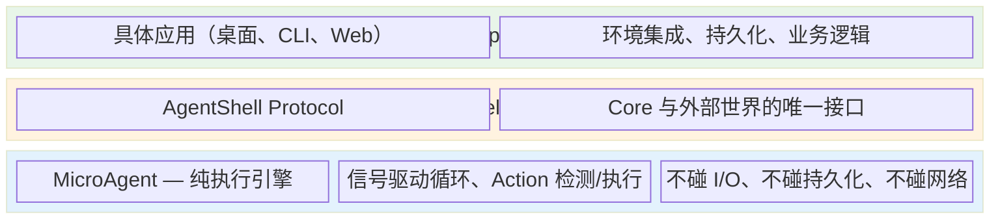
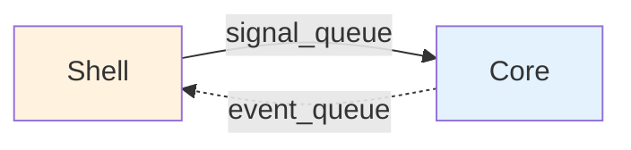
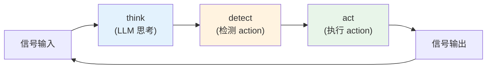
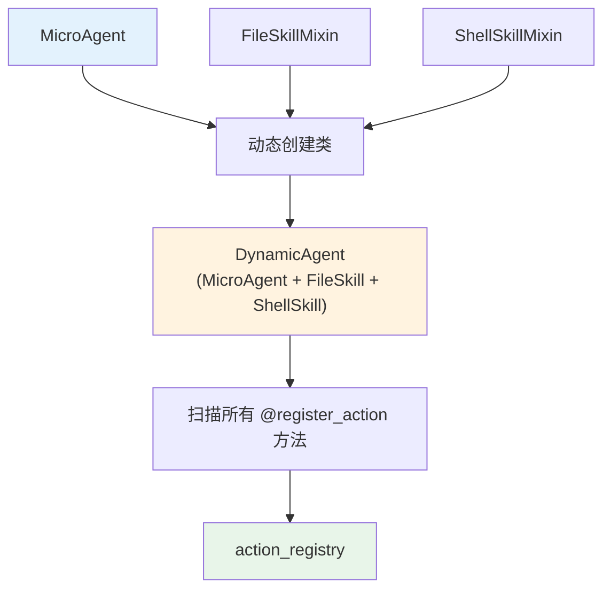
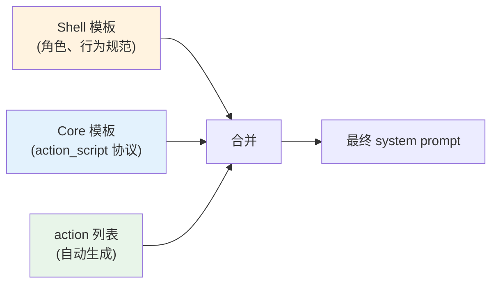

# Core 机制

AgentMatrix 的核心运行原理。

---

## 三层架构

```
┌──────────────────────────────────────────────────┐
│  App 层                                          │
│  具体应用（桌面、CLI、Web）                         │
│  环境集成、持久化、业务逻辑                          │
├──────────────────────────────────────────────────┤
│  Shell 层                                        │
│  AgentShell Protocol                             │
│  Core 与外部世界的唯一接口                          │
├──────────────────────────────────────────────────┤
│  Core 层                                         │
│  MicroAgent — 纯执行引擎                          │
│  信号驱动循环、Action 检测/执行                     │
│  不碰 I/O、不碰持久化、不碰网络                     │
└──────────────────────────────────────────────────┘
```



**Core** 是纯框架逻辑，只依赖 Protocol，不依赖任何具体类。它做的事很简单：收信号 → 思考 → 检测 action → 执行 action → 发事件。

**Shell** 是接口协议，定义 Core 与外部交互的契约。它决定怎么加载模板、怎么存消息、怎么检查 LLM 健康。

**App** 是具体实现，决定 Agent 在什么环境下运行。同一个 Core 可以跑在桌面应用里，也可以跑在 CLI 里，也可以跑在 Web 服务里。

---

## 通信模型

Core 和 Shell 通过两个异步队列通信：

```
Shell                           Core
  │                               │
  │── signal_queue ──────────→    │  Shell 推送输入信号
  │                               │
  │   ← ─ ─ event_queue ─ ─ ─ ── │  Core 广播事件
  │                               │
```



**signal_queue（Shell → Core）**：Shell 把外部输入封装为 Signal，推入队列。Core 在主循环中消费。信号可以是用户消息、邮件、Action 执行结果，任何进入 Core 的东西都是 Signal。

**event_queue（Core → Shell）**：Core 在关键节点广播事件。Shell 消费后做持久化、UI 更新、邮件标记已读等。事件包括：LLM 思考完成、Action 检测到、Action 执行完成/失败、状态变化等。

这种设计让 Core 完全不知道输入从哪来（邮件？终端？API？），也不知道事件发到哪去（数据库？WebSocket？控制台？）。

---

## 执行引擎

MicroAgent 的核心是一个 **信号驱动的 think-detect-act 循环**：

```
信号输入 → think → detect → act → 信号输出 → (循环)
```



每一轮循环：

1. **取信号** — 从 signal_queue 批量取出信号，注入到消息历史
2. **Think** — 调用 LLM 生成回复
3. **Detect** — 从回复中提取 `<action_script>` 块，解析出要执行的 action
4. **Act** — 逐个执行 action，每个完成后发 ActionCompletedSignal 回到队列
5. **循环** — 拿到 action 结果信号后，回到第 1 步继续思考

循环退出条件：
- LLM 回复中没有要执行的 action（声明式退出）
- 执行了指定的 exit_action

### Action 检测

LLM 在回复中用 `<action_script>` 块声明要执行的 action：

```
我来读取配置文件。

<action_script>
file.read(path="/app/config.json")
</action_script>
```

Core 提取块内容，逐行解析 `action_name(params)` 格式，在 action_registry 中验证合法性。如果 LLM 输出了不存在的 action 名，Core 会发一个警告信号让 LLM 纠正。

### Action 执行

解析出的参数先走快速路径（正则解析 + 校验），失败才走慢速路径（小脑对齐参数名 + Brain 补缺失值）。大多数情况零额外 LLM 调用。

多个 action 按顺序执行，每个完成后注入 `ActionCompletedSignal` 驱动下一轮思考。

---

## Skill 系统

Agent 的能力通过 Skill 扩展。每个 Skill 是一组相关的 action，以 Mixin 类的形式注入到 MicroAgent：



创建 MicroAgent 时传入 `available_skills=["file", "shell"]`，框架自动发现对应的 Mixin 类，用 `type()` 动态创建继承链，然后扫描所有 `@register_action` 方法注册到 action_registry。

这个设计让 Skill 完全解耦——每个 Skill 是独立的 Mixin 类，不需要修改 Core 代码。

---

## AgentShell 协议

Core 通过 AgentShell 协议与外部世界交互。Shell 实现这个协议，Core 调用它：

| 方法 | Core 为什么需要 |
|------|----------------|
| `brain` / `cerebellum` | 调用 LLM、对齐参数 |
| `get_prompt_template` | 获取 system prompt 等模板 |
| `compress_messages` | token 超阈值时压缩对话历史 |
| `checkpoint` | 循环关键点的协作式暂停/恢复 |
| `is_llm_available` | 检查 LLM 服务健康 |

Core 只调用这些方法，不知道具体实现。桌面应用可能从数据库加载模板、用 WebSocket 检查 LLM 健康；CLI 可能从文件加载、简单返回 True。

---

## SessionStore 协议

消息持久化接口。Core 通过它读写对话历史，不知道存储方式：

| 方法 | 说明 |
|------|------|
| `load_messages()` | 加载对话历史 |
| `save_messages(messages)` | 保存对话历史 |

可以是 JSON 文件、SQLite、Redis、内存，甚至不实现（每次从头开始）。

---

## Prompt 体系

Prompt 分两层，各有所属：

**Shell 拥有** — 业务模板（SYSTEM_PROMPT、COLLAB_MODE 等），决定 Agent 的角色和行为规范。Shell 通过 `get_prompt_template()` 提供给 Core。

**Core 拥有** — 协议模板（`<action_script>` 块的格式说明），因为它和检测逻辑紧密耦合。Core 自动注入到 system prompt 中。

```
最终 system prompt = Shell 的业务模板 + Core 的协议模板 + 自动生成的 action 列表
```



---

## 更多

- 开发指南 → `docs/developing-agents.md`
- Tutorial CLI → `tutorial/cli-agent/`
- 源码 → `src/agentmatrix/core/`
