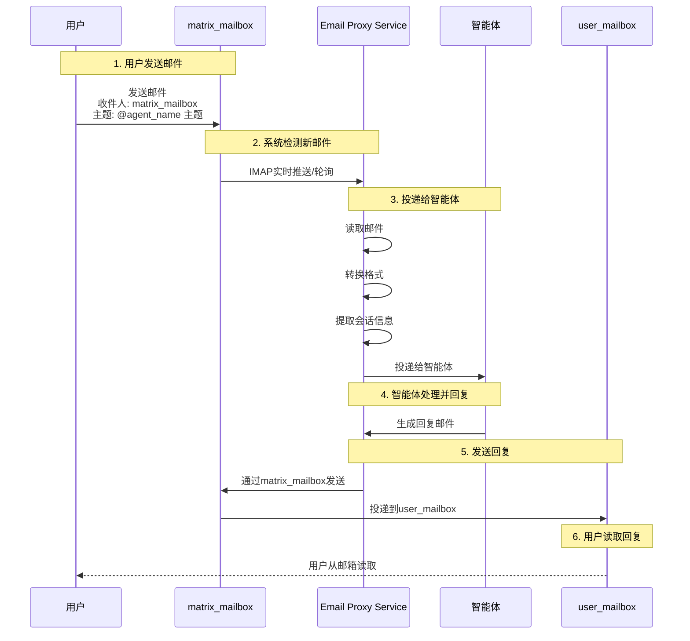

# 内外邮件映射

## 涉及的邮箱

Email Proxy Service 涉及两个邮箱，它们的作用不同。

### 用户的邮箱（user_mailbox）

这是用户的个人邮箱，比如 `user@gmail.com`。

- **作用**：代表用户本人
- **用途**：用户从邮箱中读取智能体的回复
- **配置位置**：`email_proxy_config.yml` 的 `user_mailbox` 和 `imap` 配置

智能体发送给用户的邮件会被投递到这个邮箱。用户可以用任何邮件客户端（Gmail、Outlook、Apple Mail）登录自己的邮箱，查看智能体的回复。

### 系统的邮箱（matrix_mailbox）

这是 AgentMatrix 系统的邮箱，比如 `agentmatrix@gmail.com`。

- **作用**：代表整个 AgentMatrix 系统
- **用途**：接收用户发给智能体的邮件，智能体的回复也通过这个邮箱发送
- **配置位置**：`email_proxy_config.yml` 的 `matrix_mailbox` 和 `smtp` 配置

用户发送邮件时，应该发送到 `matrix_mailbox`。Email Proxy Service 读取这个邮箱，解析邮件内容，分发给对应的智能体。

## Email Proxy Service 的核心职责

Email Proxy Service 是连接外部邮件系统和内部 AgentMatrix 系统的桥梁。

它的核心工作是：
1. **读取外部邮件**：从 `matrix_mailbox` 读取用户发送给智能体的邮件
2. **转换格式**：把标准邮件格式转换成 AgentMatrix 的 Email 对象
3. **会话恢复**：从邮件中提取或推断会话信息
4. **投递给智能体**：调用 UserProxyAgent 的 speak 方法，把邮件交给智能体

智能体发送回复时，流程相反：
1. 智能体生成回复邮件
2. Email Proxy Service 把回复邮件通过 `matrix_mailbox` 发送给用户
3. 用户从 `user_mailbox` 读取回复

## 邮件流向图



## Subject 标记规则

邮件的主题（Subject）在内外邮件转换中很关键，它编码了路由信息。

### 用户发送新邮件

主题格式：`@{agent_name} 主题内容`

例子：`@CalculatorBot 请帮我计算 123+456`

`@` 符号明确指定邮件是发给哪个智能体的。Email Proxy Service 解析 `@` 后面的智能体名字，把邮件投递给对应的智能体。

### 智能体回复邮件

主题格式：`原始主题 #{agent_name}`

例子：`请帮我计算 123+456 #CalculatorBot`

`#` 后面的智能体名字标记让用户一眼看出是哪个智能体的回复。

### 邮件回复（线程）

如果是回复邮件，主题通常保持不变（邮件客户端自动添加 `Re:` 前缀）。Email Proxy Service 通过 `in_reply_to` 字段识别这是回复邮件，找到原始会话。

### 特殊的 ask_user 邮件

当智能体需要向用户提问时，会发送特殊格式的邮件：

主题：`请回答问题 #ASK_USER#{agent_name}#{session_id}#`

这个主题编码了智能体名字和会话 ID，当用户回复时，Email Proxy Service 能够正确路由到原始会话。

## 会话回溯机制

外部邮件没有 AgentMatrix 的会话标识符（session_id、task_id）。Email Proxy Service 需要从邮件中恢复这些信息。

有两种方式：

### 主路径：映射表

系统维护一个数据库表，记录外部邮件的 Message-ID 和内部邮件 ID 的对应关系。

当智能体发送外部邮件时，会记录这个映射。当收到回复邮件时，系统查看 `in_reply_to` 字段，找到原始邮件的 Message-ID，然后在映射表中查找对应的会话标识符。

### 备用路径：邮件末尾标记

每封从 AgentMatrix 发出的邮件末尾会被添加一个特殊标记：

```
AMX:{agent_name}:{task_id}:{user_session_id}:{agent_session_id}
```

这个标记包含恢复会话所需的所有信息。如果映射表查找失败，系统可以解析邮件末尾的标记，恢复会话。

备用路径很重要，它提供了容错能力。即使映射表数据丢失或被清理，系统仍然能通过邮件内容恢复会话。

## 实时推送与轮询

Email Proxy Service 需要及时检测新邮件。

### IDLE 实时推送（首选）

使用 IMAP IDLE 协议，邮件服务器在有新邮件时主动推送通知。服务可以几乎实时地收到新邮件，然后立即处理。

### 轮询降级

不是所有邮件服务器都支持 IDLE。当 IDLE 不可用时，服务降级到轮询模式，每 2 分钟检查一次新邮件。

服务会定期尝试重新建立 IDLE 连接。一旦成功，自动从轮询切换回实时推送模式。

## 邮件线程化处理

Email Proxy Service 正确设置邮件的引用字段，确保邮件客户端能正确显示会话线程。

当发送回复邮件时，`in_reply_to` 设置为用户邮件的 Message-ID，`References` 字段包含完整的回复链。

这样设置后，在邮件客户端中查看时，智能体的回复会正确地显示为对用户邮件的回复，相关邮件被组织在一个会话线程中。

## 总结

Email Proxy Service 通过两个邮箱实现了内外邮件系统的无缝集成。

- **user_mailbox**：用户的邮箱，代表用户本人
- **matrix_mailbox**：系统的邮箱，代表整个系统

用户发送到 `matrix_mailbox` 的邮件被读取、转换、投递给智能体。智能体的回复通过 `matrix_mailbox` 发送，用户从 `user_mailbox` 读取。

通过 Subject 标记、会话回溯、实时推送等机制，服务实现了可靠的、实时的双向邮件通信。
