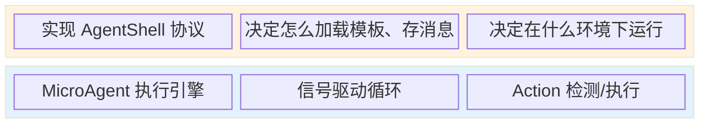
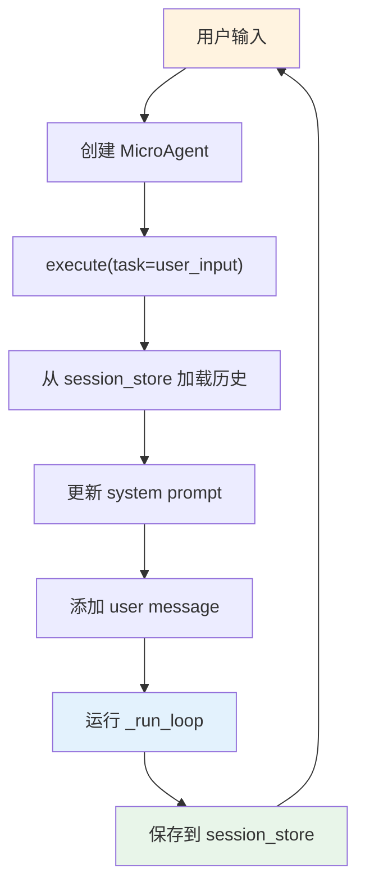

# 开发 Agent

基于 AgentMatrix Core 构建自己的 Agent。

---

## 快速开始

最简单的方式是运行 tutorial CLI Agent：

```bash
cd tutorial/cli-agent
python main.py --url https://your-api.com/v1/chat/completions --api-key sk-xxx -m gpt-4o
```

试试这些对话：
- "列出当前目录的文件" → agent 调用 `file.list_dir`
- "创建 hello.txt 写入 hello world" → agent 调用 `file.write`
- "执行 ls -la" → agent 调用 `shell.bash`

读完这个文档后，看 `tutorial/cli-agent/` 的源码，它是完整的参考实现。

---

## 核心概念：Agent = Shell + Core

```
┌─────────────────────────────────┐
│  你的代码（Shell）                │
│  - 实现 AgentShell 协议          │
│  - 决定怎么加载模板、存消息        │
│  - 决定在什么环境下运行           │
├─────────────────────────────────┤
│  AgentMatrix（Core）             │
│  - MicroAgent 执行引擎           │
│  - 信号驱动循环                  │
│  - Action 检测/执行              │
└─────────────────────────────────┘
```



Core 是框架，你不需要改它。你需要做的是：
1. 实现 AgentShell — 告诉 Core 怎么和外部世界交互
2. 创建 Skills — 告诉 Agent 能做什么
3. 组装启动

---

## Step 1: 实现 AgentShell

AgentShell 是 Core 与外部的唯一接口。最少需要实现这些：

```python
from agentmatrix.core.agent_shell import AgentShell
from agentmatrix.core.cerebellum import Cerebellum
from agentmatrix.core.backends.llm_client import LLMClient

class MyShell:
    name: str = "my-agent"
    persona: str = ""
    brain: LLMClient          # LLM 客户端
    cerebellum: Cerebellum     # 参数对齐器
    logger: logging.Logger

    def __init__(self, url, api_key, model):
        self.logger = logging.getLogger("MyShell")
        self.brain = LLMClient(url, api_key, model, parent_logger=self.logger)
        self.cerebellum = Cerebellum(self.brain, "my-agent", parent_logger=self.logger)

    def get_prompt_template(self, name: str) -> str:
        return "你是一个有用的助手。"  # 或从文件加载

    async def generate_working_notes(self, messages, focus_hint="") -> str:
        return "(working notes)"  # 或用 LLM 生成

    async def compress_messages(self, agent) -> None:
        # 简单实现：保留 system + 最近消息
        if agent.messages[0].get("role") == "system":
            agent.messages = [agent.messages[0]]
        agent.scratchpad.clear()

    async def checkpoint(self) -> None:
        pass  # 或检查 paused/stopped 标志

    def get_md_skill_prompt(self, skill_names) -> str:
        return ""  # 或读取 SKILL.md

    def is_llm_available(self) -> bool:
        return True

    async def wait_for_llm_recovery(self) -> None:
        await asyncio.sleep(5)
```

完整实现参考 `tutorial/cli-agent/cli_shell.py`。

---

## Step 2: 创建 Skill

Skill 是一组相关的 action。用 `@register_action` 装饰器标记方法：

```python
from agentmatrix.core.action import register_action

class FileSkillMixin:
    _skill_description = "文件操作"  # 可选，给 help 看

    @register_action(
        short_desc="读取文件",           # action 列表里的简短描述
        description="读取文件内容",       # help 里的详细描述
        param_infos={"path": "文件路径"}, # 参数名 → 说明
    )
    async def read(self, path: str) -> str:
        with open(path) as f:
            return f.read()

    @register_action(
        short_desc="写入文件",
        description="写入内容到文件",
        param_infos={"path": "文件路径", "content": "内容"},
    )
    async def write(self, path: str, content: str) -> str:
        with open(path, "w") as f:
            f.write(content)
        return f"已写入 {path}"
```

### 命名约定

- 文件名：`{skill_name}_skill.py`
- 类名：`{Name}SkillMixin`
- 方法名就是 action 名

注册到 SkillRegistry：

```python
from agentmatrix.core.skills.registry import SKILL_REGISTRY
SKILL_REGISTRY.register_python_mixin("file", FileSkillMixin)
```

完整参考 `tutorial/cli-agent/skills/file_skill.py`。

---

## Step 3: 组装启动

```python
import asyncio
from agentmatrix.core.micro_agent import MicroAgent

async def main():
    shell = MyShell(url="...", api_key="...", model="gpt-4o")

    agent = MicroAgent(
        parent=shell,
        name="my-agent",
        available_skills=["file", "shell"],  # 要加载的 skills
        system_prompt="你是一个有用的助手。",
    )

    result = await agent.execute(
        run_label="my-task",
        task="列出当前目录的文件",
    )
    print(result)

asyncio.run(main())
```

### MicroAgent 构造参数

| 参数 | 说明 |
|------|------|
| `parent` | AgentShell 实例（或另一个 MicroAgent） |
| `name` | Agent 名称（用于日志） |
| `available_skills` | skill 名称列表（如 `["file", "shell"]`） |
| `system_prompt` | system prompt 模板 |
| `md_skill_names` | MD skill 名称列表（可选） |
| `compression_token_threshold` | 压缩阈值（默认 64000） |

### execute() 参数

| 参数 | 说明 |
|------|------|
| `run_label` | 执行标识（用于日志） |
| `task` | 任务描述（可空，通过 signal_queue 注入） |
| `session_store` | 消息持久化（可选） |
| `exit_actions` | 执行哪些 action 后退出（可选） |

---

## 响应协议

LLM 在回复中用 `<action_script>` 块声明要执行的 action：

```
我来读取配置文件。

<action_script>
file.read(path="/app/config.json")
</action_script>
```

多个 action 按顺序执行：

```
<action_script>
file.read(path="config.json")
file.write(path="config.json", content='{"updated": true}')
</action_script>
```

不需要执行 action 时，不输出 `<action_script>` 块：

```
目前没有需要执行的操作。
```

---

## SessionStore

如果需要持久化对话历史，实现 SessionStore：

```python
class MySessionStore:
    def load_messages(self) -> list:
        # 从数据库/文件加载
        return [...]

    async def save_messages(self, messages: list) -> None:
        # 保存到数据库/文件
        pass
```

传给 `execute()`：

```python
await agent.execute(
    run_label="chat",
    task="你好",
    session_store=MySessionStore(),
)
```

参考 `tutorial/cli-agent/cli_session.py`（内存实现）。

---

## 多轮对话

每次 `execute()` 创建新的 MicroAgent 实例，但通过 SessionStore 保持历史：

```python
session_store = InMemorySessionStore()

while True:
    user_input = input("> ")
    agent = MicroAgent(parent=shell, name="chat", ...)
    result = await agent.execute(
        run_label="chat",
        task=user_input,
        session_store=session_store,  # 复用同一个 store
    )
```

`execute()` 流程：
1. 从 store 加载历史
2. 更新 system prompt
3. 添加新 user message
4. 运行循环
5. finally 保存到 store



---

## 事件消费

Core 通过 `event_queue` 广播事件。消费事件用于 UI 更新、日志等：

```python
import asyncio

async def consume_events(agent):
    while True:
        event = await agent.event_queue.get()
        if event.event_type == "think":
            print(f"[think] {event.detail['thought'][:100]}")
        elif event.event_type == "action" and event.event_name == "completed":
            print(f"[action] {event.detail['action_name']} done")

# 启动消费 task
asyncio.create_task(consume_events(agent))

# 然后执行 agent
await agent.execute(...)
```

---

## 完整示例

最简 Agent（约 50 行）：

```python
import asyncio
import logging
from agentmatrix.core.micro_agent import MicroAgent
from agentmatrix.core.cerebellum import Cerebellum
from agentmatrix.core.backends.llm_client import LLMClient
from agentmatrix.core.action import register_action
from agentmatrix.core.skills.registry import SKILL_REGISTRY

# 定义 skill
class EchoSkillMixin:
    @register_action(short_desc="回显文本", description="回显用户输入的文本",
                     param_infos={"text": "要回显的文本"})
    async def echo(self, text: str) -> str:
        return f"Echo: {text}"

SKILL_REGISTRY.register_python_mixin("echo", EchoSkillMixin)

# 实现 shell
class MinimalShell:
    name = "minimal"
    persona = ""
    def __init__(self):
        self.logger = logging.getLogger("Minimal")
        self.brain = LLMClient("https://api.openai.com/v1/chat/completions",
                               "sk-xxx", "gpt-4o", parent_logger=self.logger)
        self.cerebellum = Cerebellum(self.brain, "minimal", parent_logger=self.logger)
    def get_prompt_template(self, name): return "你是一个助手。用 echo action 回显文本。"
    async def generate_working_notes(self, m, f=""): return ""
    async def compress_messages(self, a): a.messages = [a.messages[0]]; a.scratchpad.clear()
    async def checkpoint(self): pass
    def get_md_skill_prompt(self, n): return ""
    def is_llm_available(self): return True
    async def wait_for_llm_recovery(self): pass

async def main():
    shell = MinimalShell()
    agent = MicroAgent(parent=shell, name="echo", available_skills=["echo"],
                       system_prompt="用 echo action 回显用户说的话。")
    result = await agent.execute(run_label="test", task="Hello!")
    print(result)

asyncio.run(main())
```

---

## 更多参考

- 框架原理 → `docs/core-mechanism.md`
- Tutorial CLI → `tutorial/cli-agent/`
- 桌面应用实现 → `src/agentmatrix/desktop/base_agent.py`
